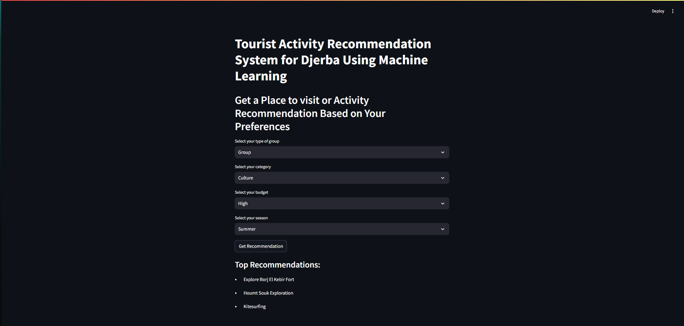

# Tourist Activity Recommendation System for Djerba 🏖️

Welcome to the **Tourist Activity Recommendation System for Djerba**! This project uses machine learning to recommend personalized activities for tourists visiting Djerba, Tunisia, based on their preferences. Whether you're looking for relaxation, adventure, or cultural experiences, this system has you covered!



## Overview 🌟

This project is a **Streamlit-based web application** that recommends tourist activities in Djerba based on user inputs such as:
- Tourist Type (Solo, Couple, Family, Group)
- Interest Category (Relaxation, Adventure, Culture)
- Budget (Low, Medium, High)
- Season (Spring, Summer, Fall, Winter)
- Duration of Stay (Short, Medium, Long)
- Accessibility (Walking, Public Transport, Car Rental)

The system uses a **RandomForestClassifier** with **SMOTE** for handling class imbalance and achieves an accuracy of **over 90%**!

---

## Features ✨

- **Personalized Recommendations**: Tailored activity suggestions based on user preferences.
- **High Accuracy**: Machine learning model with >90% accuracy.
- **User-Friendly Interface**: Built with Streamlit for an intuitive and interactive experience.
- **Handles Class Imbalance**: Uses SMOTE to ensure balanced predictions.

---

## How It Works 🛠️

1. **Data Preprocessing**:
   - The dataset is one-hot encoded to convert categorical features into numeric values.
   - SMOTE is applied to handle class imbalance in the target variable.

2. **Model Training**:
   - A **RandomForestClassifier** is trained using **GridSearchCV** for hyperparameter tuning.
   - The model is evaluated on a test set to ensure high accuracy.

3. **Recommendation System**:
   - Users input their preferences via the Streamlit interface.
   - The model predicts the top 3 activities with confidence scores.

---

## Tech Stack 💻

- **Python**: Primary programming language.
- **Streamlit**: For building the web application.
- **Scikit-learn**: For machine learning (RandomForestClassifier, GridSearchCV).
- **Pandas**: For data manipulation and preprocessing.
- **NumPy**: For numerical computations.
- **Imbalanced-learn (SMOTE)**: For handling class imbalance.

---

## Installation 🚀

To run this project locally, follow these steps:

1. **Clone the Repository**:
   ```bash
   git clone https://github.com/your-username/Djerba-Tourist-Recommendation.git
   cd Djerba-Tourist-Recommendation